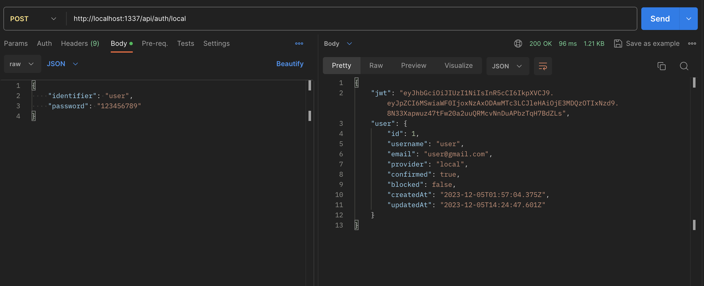
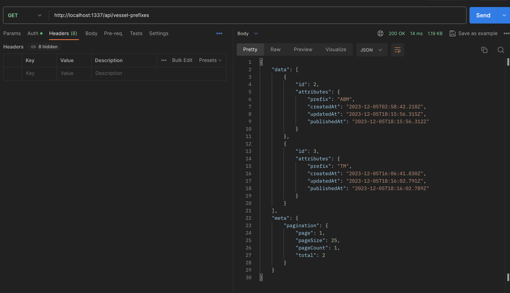
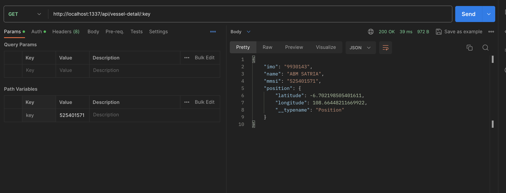
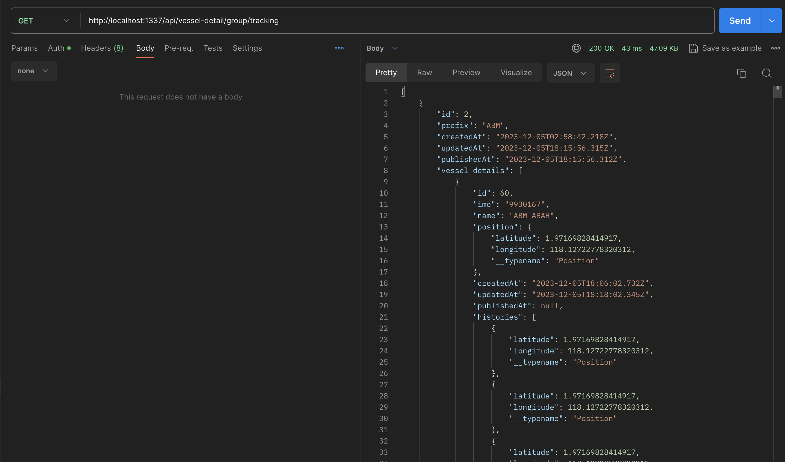
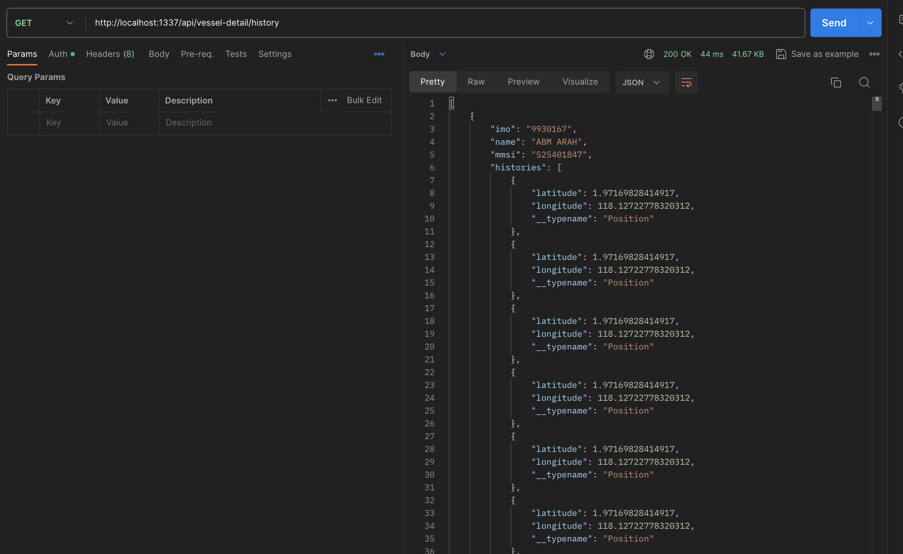

### User test
```
{
    "identifier": "user",
    "password": "123456789"
}
```

### Postman documentation
[collection-vessel-test](doc/VESSEL-TEST.postman_collection.json)

### Documentation

##### 1. Login API


##### 2. Find Prefix


##### 3. FInd Vessel Location


##### 4. Find Tracking Group tracking


##### 5. Find Tracking Group tracking



<br>

<i>Please contact me if any question or consern in:
fadli.mohamad62@gmail.com</i>

# 🚀 Getting started with Strapi

Strapi comes with a full featured [Command Line Interface](https://docs.strapi.io/dev-docs/cli) (CLI) which lets you scaffold and manage your project in seconds.

### `develop`

Start your Strapi application with autoReload enabled. [Learn more](https://docs.strapi.io/dev-docs/cli#strapi-develop)

```
npm run develop
# or
yarn develop
```

### `start`

Start your Strapi application with autoReload disabled. [Learn more](https://docs.strapi.io/dev-docs/cli#strapi-start)

```
npm run start
# or
yarn start
```

### `build`

Build your admin panel. [Learn more](https://docs.strapi.io/dev-docs/cli#strapi-build)

```
npm run build
# or
yarn build
```